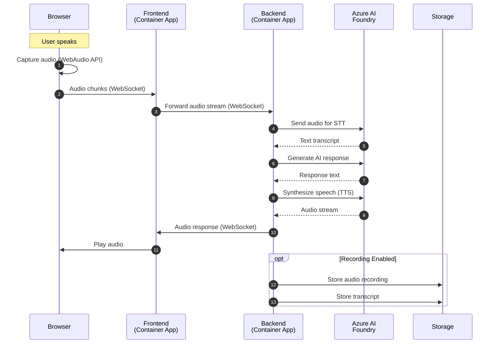
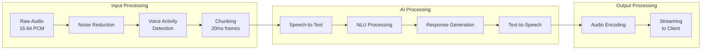
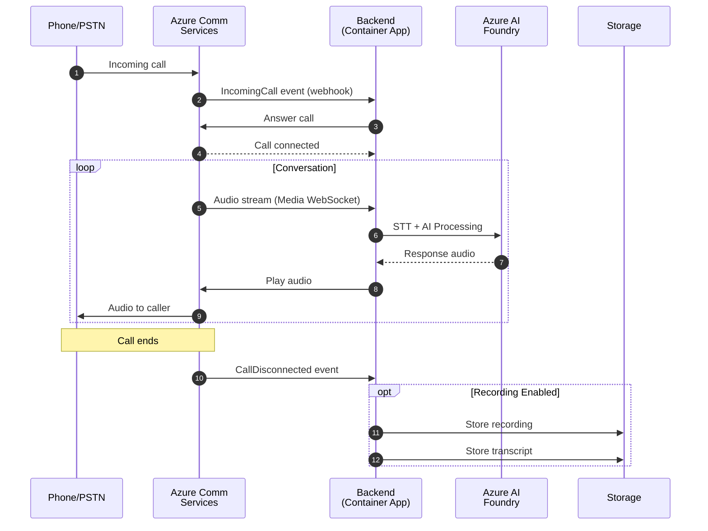
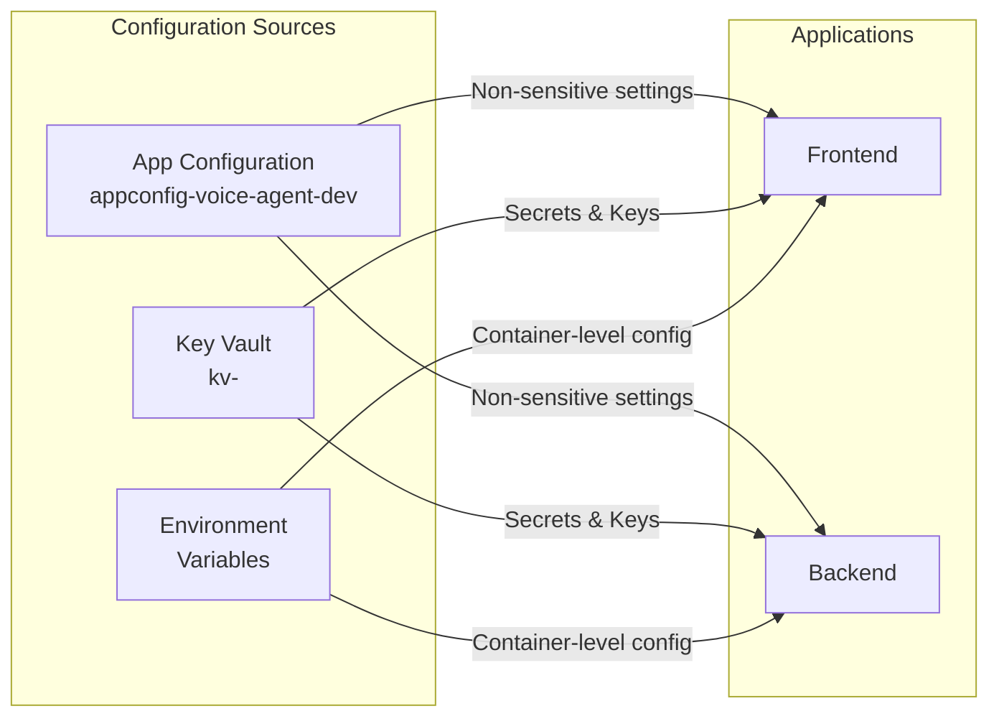
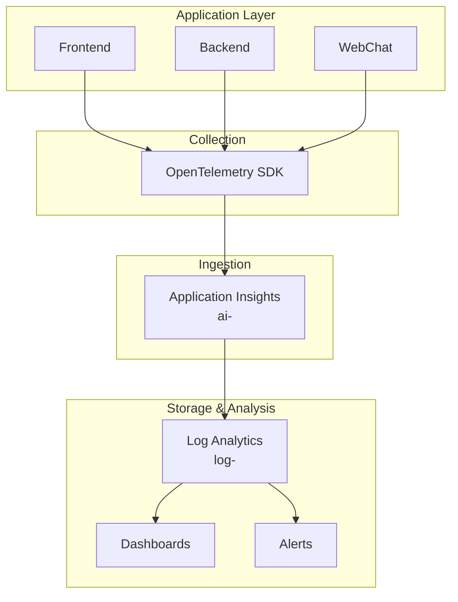
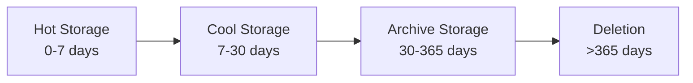
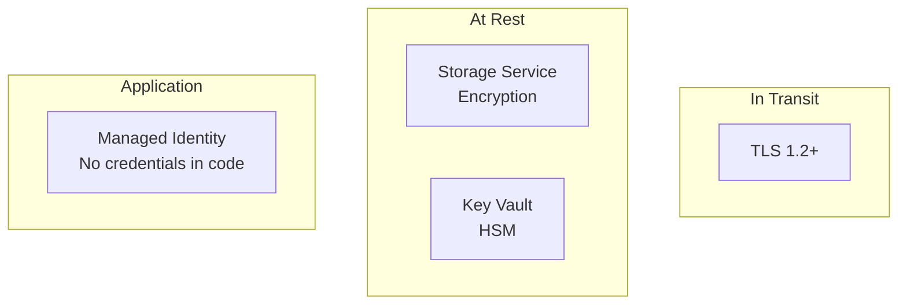

# Data Flow Documentation

This document details the data flows within the Real-Time Audio Voice Agent system.

## Overview

The system processes three primary types of data:
1. **Audio Data** - Real-time voice streams
2. **Text Data** - Transcripts and AI responses
3. **Telemetry Data** - Logs, metrics, and traces

---

## Audio Data Flow

### Web-Based Voice Interaction



### Audio Processing Pipeline



### Audio Format Specifications

| Stage | Format | Sample Rate | Channels |
|-------|--------|-------------|----------|
| Browser Capture | PCM | 16000 Hz | Mono |
| WebSocket Transport | PCM/Opus | 16000 Hz | Mono |
| STT Input | PCM | 16000 Hz | Mono |
| TTS Output | MP3/PCM | 24000 Hz | Mono |
| Storage | WAV/MP3 | 16000 Hz | Mono |

---

## Phone Call Data Flow



---

## Text Data Flow

### Configuration Data



### Configuration Hierarchy

```yaml
# Priority (highest to lowest)
1. Environment Variables (container-level)
2. Key Vault Secrets (for sensitive data)
3. App Configuration (for runtime settings)
4. Default values (in code)
```

---

## Telemetry Data Flow



### Telemetry Types

| Type | Source | Destination | Retention |
|------|--------|-------------|-----------|
| Requests | All apps | Application Insights | 90 days |
| Dependencies | All apps | Application Insights | 90 days |
| Exceptions | All apps | Application Insights | 90 days |
| Traces | All apps | Application Insights | 90 days |
| Custom Metrics | Backend | Application Insights | 90 days |
| Container Logs | Container Apps | Log Analytics | 30 days |

---

## Data Storage Patterns

### Blob Storage Organization

```
st<suffix>/
├── audio-recordings/
│   ├── 2026/
│   │   ├── 02/
│   │   │   ├── 03/
│   │   │   │   ├── {call-id}.wav
│   │   │   │   └── {call-id}.json  (metadata)
├── transcripts/
│   ├── 2026/
│   │   ├── 02/
│   │   │   ├── 03/
│   │   │   │   └── {call-id}.json
└── exports/
    └── {export-id}/
```

### Data Lifecycle



---

## Security & Compliance

### Data Classification

| Data Type | Classification | Encryption | Retention |
|-----------|---------------|------------|-----------|
| Audio recordings | Confidential | At-rest + In-transit | 90 days |
| Transcripts | Confidential | At-rest + In-transit | 90 days |
| Configuration | Internal | At-rest | N/A |
| Secrets | Restricted | HSM-backed | N/A |
| Telemetry | Internal | At-rest + In-transit | 90 days |

### Encryption



---

## Data Privacy

### PII Handling

| Data Element | Treatment |
|--------------|-----------|
| Voice audio | Stored encrypted, access-controlled |
| Phone numbers | Masked in logs |
| Transcripts | May contain PII, encrypted storage |
| IP addresses | Anonymized in telemetry |

### Data Subject Rights

For GDPR/privacy compliance:
- **Right to Access**: Query transcripts and recordings by user ID
- **Right to Deletion**: Delete audio and transcripts by call ID
- **Right to Portability**: Export data in standard formats
