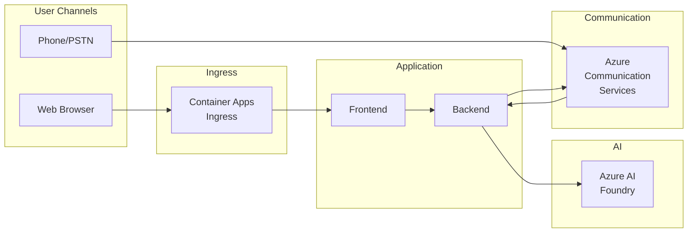
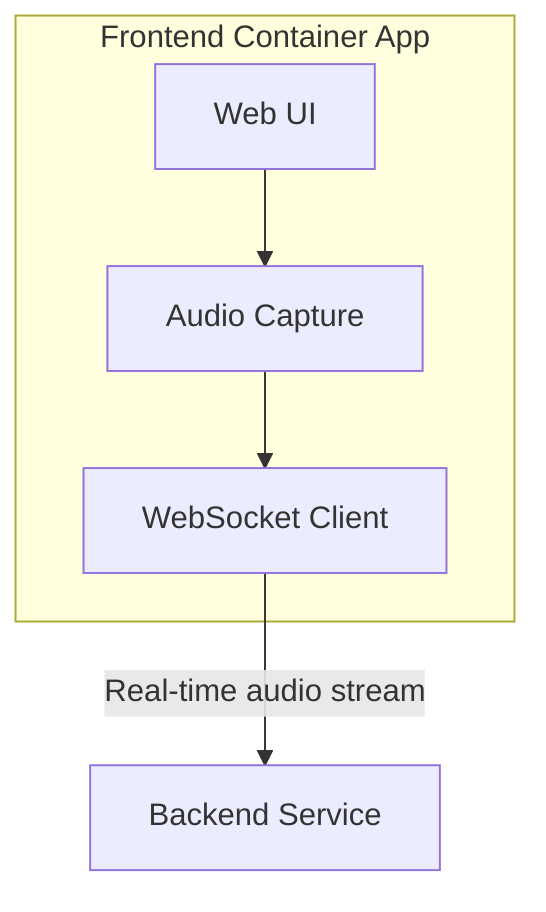
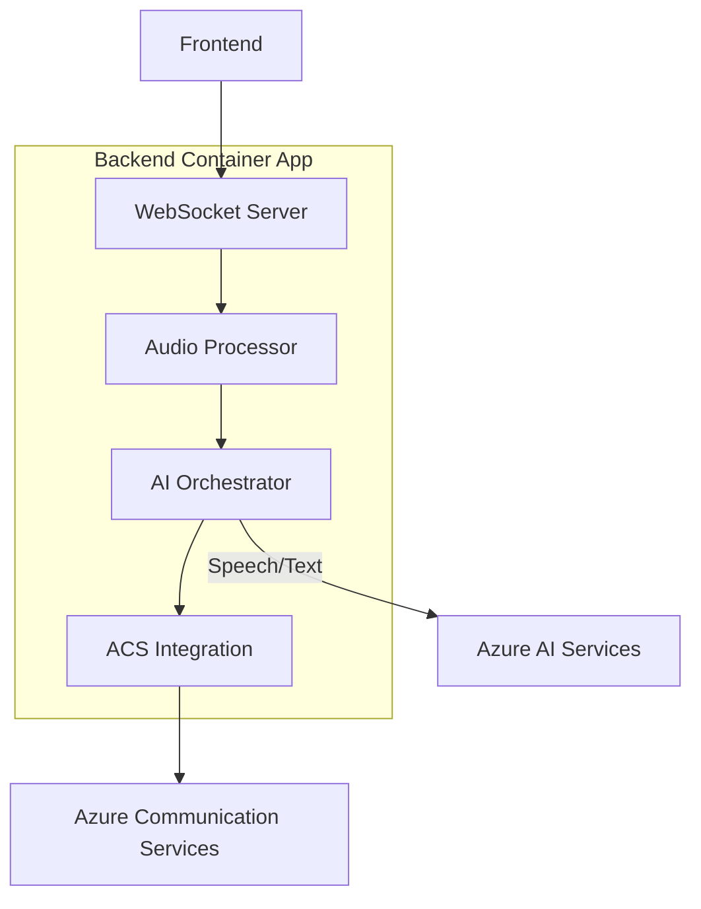
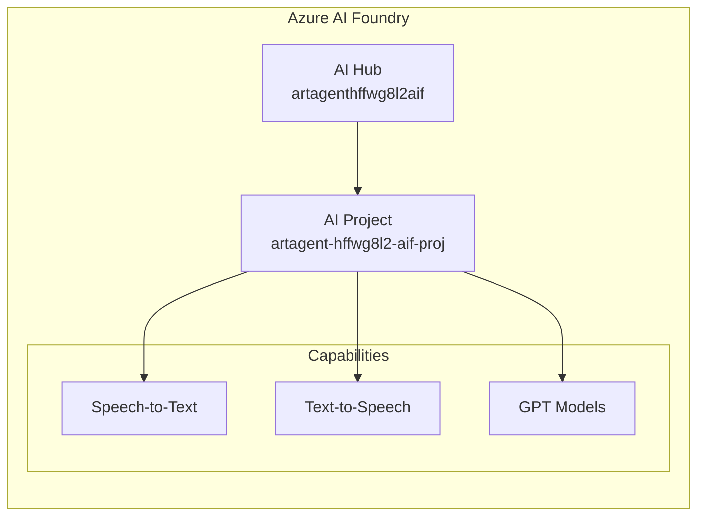
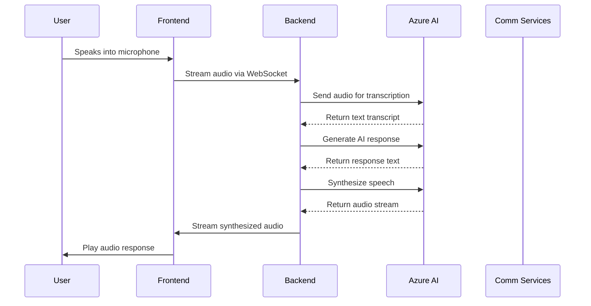
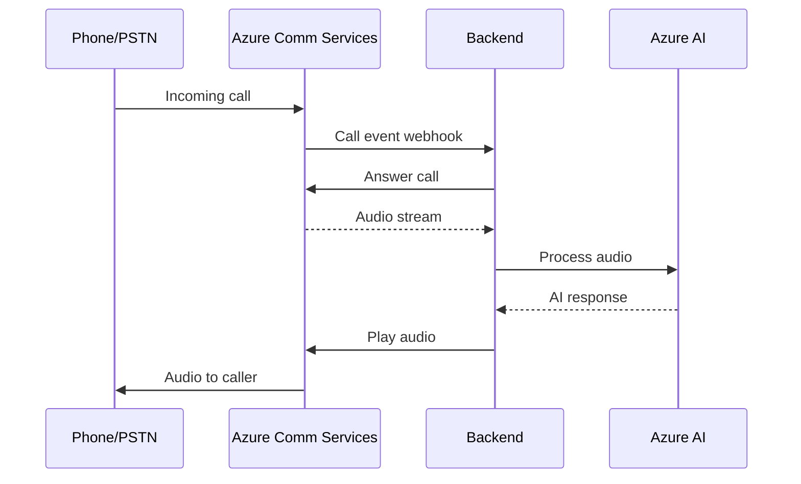
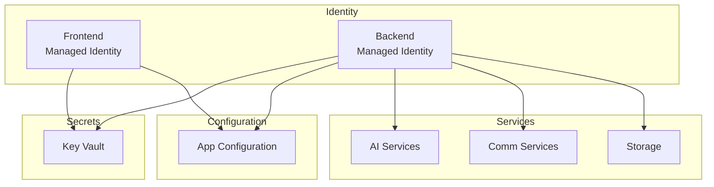
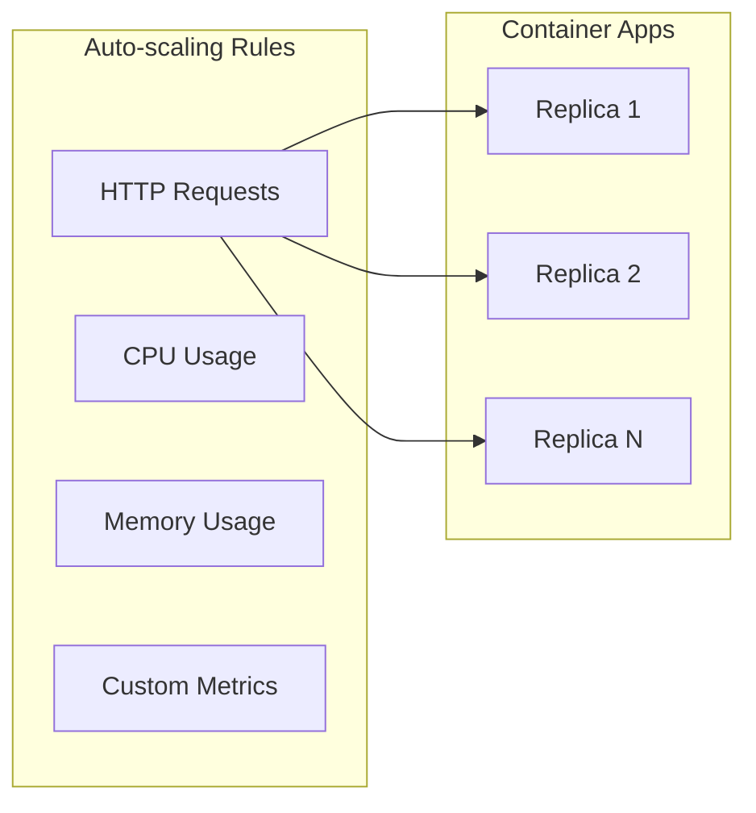

# Architecture Overview

## Executive Summary

The Real-Time Audio Voice Agent is a cloud-native solution that enables real-time voice interactions with AI-powered conversational agents. Built on Azure's serverless container platform and AI services, it provides a scalable, secure, and cost-effective architecture for voice-based AI applications.

## Architecture Principles

1. **Serverless-First**: Container Apps provide automatic scaling and pay-per-use billing
2. **Zero-Trust Security**: Managed identities eliminate credential management
3. **Observability by Default**: Full telemetry pipeline from day one
4. **Infrastructure as Code**: Terraform ensures reproducible deployments
5. **Separation of Concerns**: Distinct frontend, backend, and AI layers

---

## High-Level Architecture

---

## Component Architecture

### Frontend (rtaudio-client)

The frontend is a web application that provides the user interface for voice interactions.

**Responsibilities**:
- Audio capture from browser microphone
- WebSocket connection management
- Real-time audio streaming to backend
- Playback of synthesized speech responses
- Visual feedback during conversations

**Technology Stack**:
- Modern JavaScript/TypeScript framework
- WebSocket for real-time communication
- Web Audio API for audio processing

---

### Backend (rtaudio-server)

The backend handles audio processing, AI orchestration, and communication services integration.

**Responsibilities**:
- WebSocket server for client connections
- Audio stream processing and buffering
- Speech-to-text conversion via Azure AI
- Conversational AI orchestration
- Text-to-speech synthesis
- Voice calling via Azure Communication Services

---

### AI Layer

**Services Used**:
- **Speech-to-Text**: Real-time transcription of user speech
- **Text-to-Speech**: Natural voice synthesis for responses
- **GPT Models**: Conversational intelligence and response generation

---

## Data Flow

### Voice Conversation Flow

### Phone Call Flow

---

## Security Architecture

**Security Features**:
- No secrets in code or environment variables
- All service-to-service auth via Managed Identity
- Key Vault for any external secrets/certificates
- App Configuration for non-sensitive settings

---

## Scalability

### Container Apps Scaling

**Scaling Configuration**:
- Min replicas: 0 (scale to zero when idle)
- Max replicas: Configurable based on load
- Scale triggers: HTTP concurrent requests, CPU, Memory

---

## Cost Optimization

| Component | Cost Driver | Optimization |
|-----------|-------------|--------------|
| Container Apps | vCPU-seconds, Memory-GB-seconds | Scale to zero, right-size containers |
| AI Services | API calls, audio minutes | Batch processing, caching |
| Communication Services | Minutes, phone numbers | Efficient call handling |
| Storage | GB stored, transactions | Lifecycle policies |
