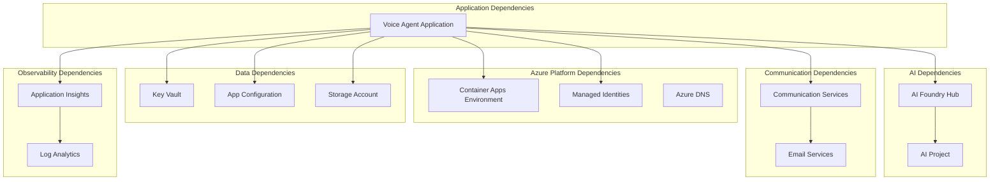
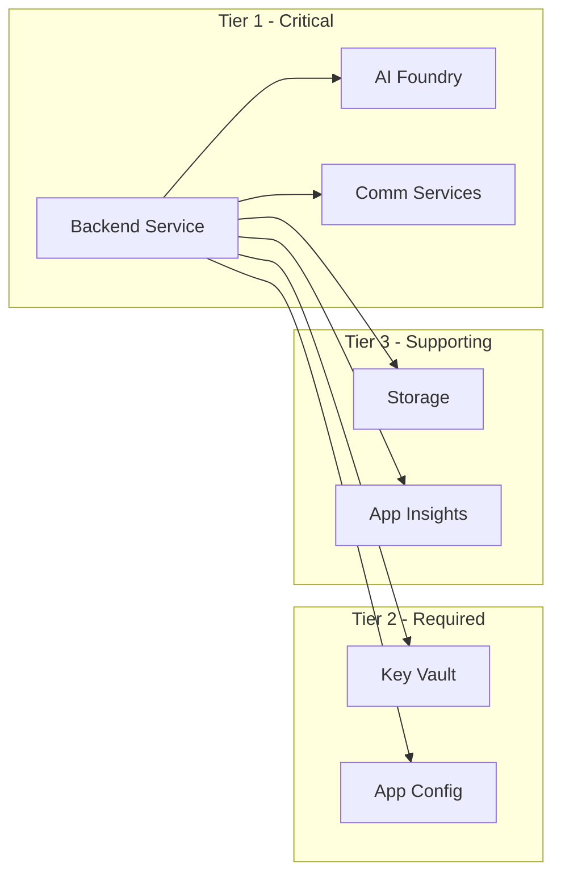
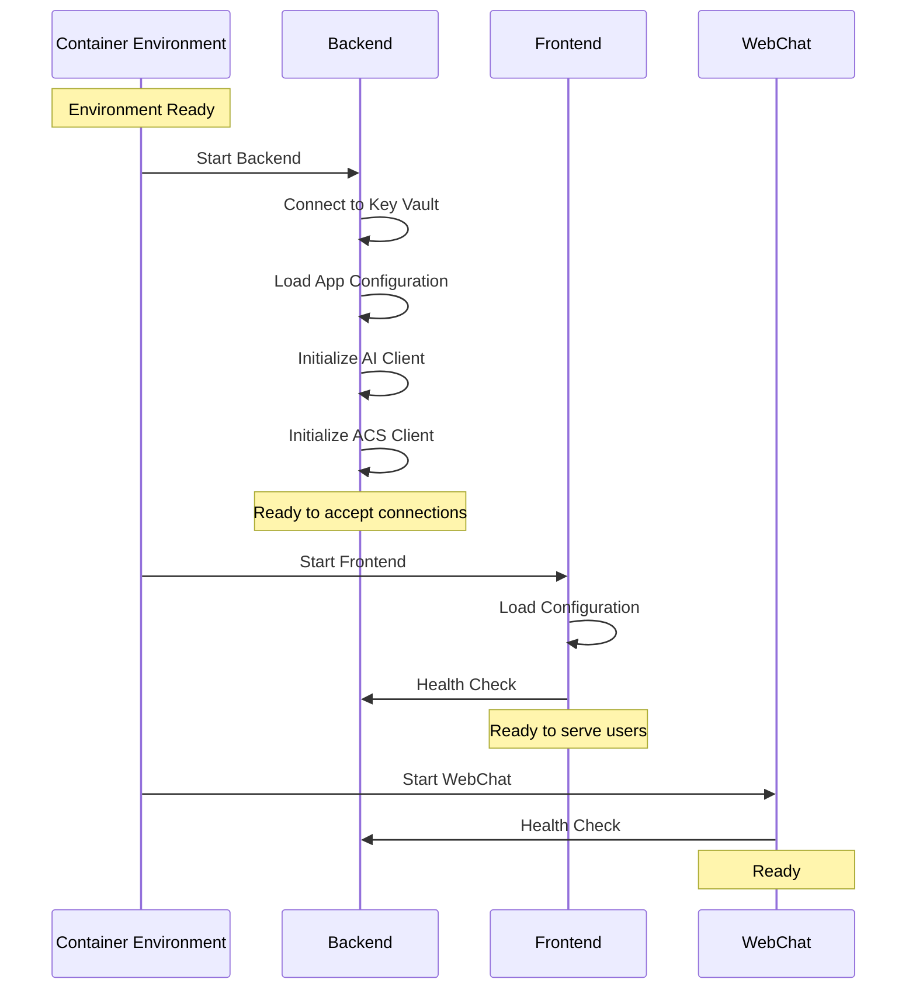

# Dependencies

This document outlines all runtime dependencies, service dependencies, and infrastructure dependencies for the Real-Time Audio Voice Agent.

## Dependency Overview



---

## Infrastructure Dependencies

### Azure Subscription
- **Subscription**: AI_Foundry (`094336d1-8e03-42a4-95dc-1085ed02d8d5`)
- **Required Quotas**: Container Apps, AI Services, Communication Services

### Resource Providers
The following Azure Resource Providers must be registered:

| Provider | Purpose |
|----------|---------|
| `Microsoft.App` | Container Apps |
| `Microsoft.ContainerRegistry` | Container Registry |
| `Microsoft.CognitiveServices` | AI Services |
| `Microsoft.Communication` | Communication Services |
| `Microsoft.KeyVault` | Key Vault |
| `Microsoft.AppConfiguration` | App Configuration |
| `Microsoft.Storage` | Storage Account |
| `Microsoft.OperationalInsights` | Log Analytics |
| `Microsoft.Insights` | Application Insights |
| `Microsoft.ManagedIdentity` | Managed Identities |

---

## Service Dependencies

### Critical Path Dependencies

These services are required for core functionality:



### Dependency Matrix

| Service | Depends On | Impact if Unavailable |
|---------|-----------|----------------------|
| Frontend | Backend, Key Vault, App Config | UI non-functional |
| Backend | AI Foundry, ACS, Key Vault, App Config, Storage | Voice processing fails |
| AI Foundry | Azure subscription, AI Project | No AI capabilities |
| Communication Services | Email Services | No voice/email capability |
| Key Vault | Managed Identity | No secret access |
| App Configuration | Managed Identity | Default config only |
| Storage | - | No audio storage |
| Application Insights | Log Analytics | No telemetry |

---

## Runtime Dependencies

### Container Runtime

| Component | Version/SKU | Purpose |
|-----------|-------------|---------|
| Container Apps Environment | Consumption | Serverless container hosting |
| Container Registry | Basic | Image storage |

### Container Images

| Service | Image | Registry |
|---------|-------|----------|
| Frontend | `rtaudio-client:latest` | crartagenthffwg8l2.azurecr.io |
| Backend | `rtaudio-server:latest` | crartagenthffwg8l2.azurecr.io |
| WebChat | `webchat-demo:latest` | crartagenthffwg8l2.azurecr.io |

---

## SDK Dependencies

### Python Dependencies (Backend)

```txt
# Azure SDKs
azure-identity>=1.15.0
azure-ai-inference>=1.0.0
azure-communication-callautomation>=1.2.0
azure-communication-email>=1.0.0
azure-keyvault-secrets>=4.8.0
azure-appconfiguration>=1.5.0
azure-storage-blob>=12.19.0
azure-monitor-opentelemetry>=1.2.0

# Web Framework
fastapi>=0.109.0
uvicorn>=0.27.0
websockets>=12.0

# Audio Processing
pydub>=0.25.0
numpy>=1.26.0
```

### JavaScript Dependencies (Frontend)

```json
{
  "dependencies": {
    "@azure/identity": "^4.0.0",
    "@azure/app-configuration": "^1.5.0",
    "socket.io-client": "^4.7.0"
  }
}
```

---

## External Dependencies

### Azure Service SLAs

| Service | SLA | Availability Zone |
|---------|-----|-------------------|
| Container Apps | 99.95% | Zone redundant optional |
| AI Services | 99.9% | Region-based |
| Communication Services | 99.9% | Global |
| Key Vault | 99.99% | Zone redundant |
| Storage (LRS) | 99.9% | Single zone |

### Network Dependencies

| Endpoint | Protocol | Purpose |
|----------|----------|---------|
| `*.azurecr.io` | HTTPS | Container image pull |
| `*.cognitiveservices.azure.com` | HTTPS | AI Services |
| `*.communication.azure.com` | HTTPS/WSS | Communication Services |
| `*.vault.azure.net` | HTTPS | Key Vault |
| `*.azconfig.io` | HTTPS | App Configuration |
| `*.blob.core.windows.net` | HTTPS | Storage |
| `*.applicationinsights.azure.com` | HTTPS | Telemetry |

---

## Startup Dependencies

### Container App Startup Order



### Health Check Endpoints

| Service | Endpoint | Expected Response |
|---------|----------|-------------------|
| Backend | `/health` | `200 OK` |
| Backend | `/ready` | `200 OK` (after dependencies ready) |
| Frontend | `/health` | `200 OK` |

---

## Dependency Versioning

### Infrastructure Versions

| Component | Version | Notes |
|-----------|---------|-------|
| Terraform | >=1.5.0 | IaC tool |
| azd | >=1.5.0 | Azure Developer CLI |
| Azure CLI | >=2.55.0 | Management CLI |

### API Versions

| Service | API Version |
|---------|-------------|
| Container Apps | 2023-05-01 |
| AI Services | 2024-02-01 |
| Communication Services | 2023-08-01-preview |
| Key Vault | 2023-07-01 |

---

## Failure Modes

### Graceful Degradation

| Dependency Failure | Impact | Mitigation |
|--------------------|--------|------------|
| AI Foundry unavailable | No AI responses | Return error message to user |
| ACS unavailable | No voice calls | Web-only mode |
| Storage unavailable | No recordings | Continue without recording |
| App Insights unavailable | No telemetry | Continue operation |
| Key Vault unavailable | Cannot start | Fail fast, alert |
| App Config unavailable | Use defaults | Cached configuration |
