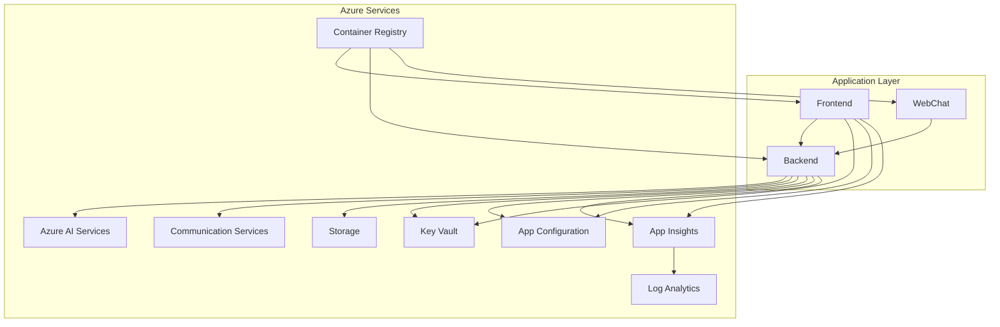
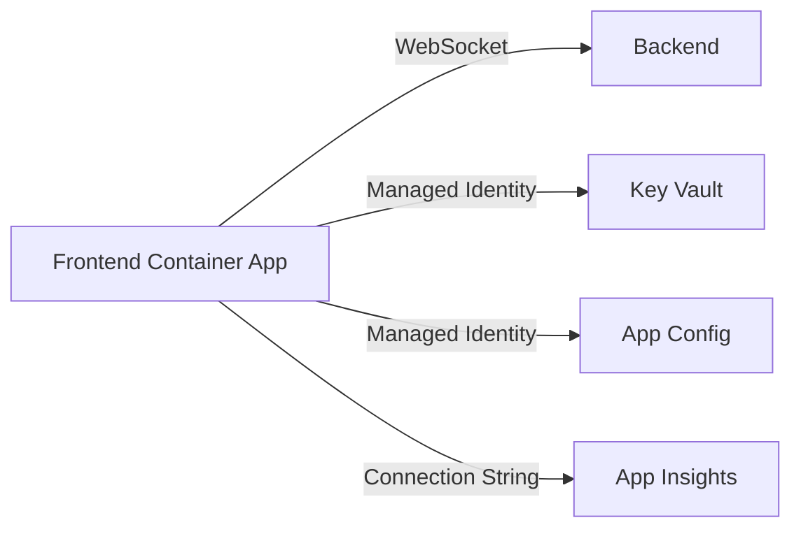
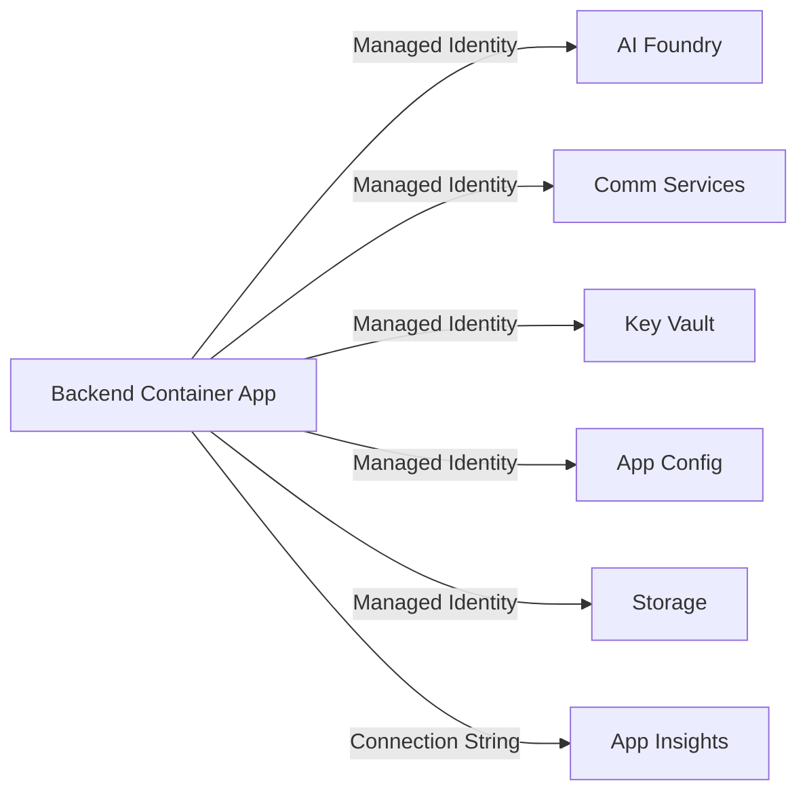

# Integration Patterns

This section documents the integration patterns and service connections within the Real-Time Audio Voice Agent architecture.

## Integration Overview



---

## Service Integrations

### 1. Azure AI Services Integration

**Connection Method**: Managed Identity + Azure SDK

```python
# Example: Azure AI Services connection
from azure.identity import DefaultAzureCredential
from azure.ai.inference import ChatCompletionsClient

credential = DefaultAzureCredential()
client = ChatCompletionsClient(
    endpoint="https://artagent<suffix>aif.cognitiveservices.azure.com/",
    credential=credential
)
```

**Endpoints**:
| Service | Endpoint Pattern |
|---------|-----------------|
| AI Hub | `https://{name}.cognitiveservices.azure.com/` |
| Speech | `https://{region}.api.cognitive.microsoft.com/` |

**Required RBAC Roles**:
- `Cognitive Services User`
- `Cognitive Services Speech User`

---

### 2. Azure Communication Services Integration

**Connection Method**: Managed Identity + Connection String (from Key Vault)

```python
# Example: ACS integration
from azure.communication.callautomation import CallAutomationClient
from azure.identity import DefaultAzureCredential

credential = DefaultAzureCredential()
client = CallAutomationClient(
    endpoint="https://acs-artagent-voice-agent-dev-<suffix>.communication.azure.com",
    credential=credential
)
```

**Capabilities**:
| Feature | API | Description |
|---------|-----|-------------|
| Voice Calls | Call Automation | Programmatic call control |
| Audio Streaming | Media Streaming | Real-time audio access |
| Email | Email API | Send transactional emails |

**Webhook Events**:
- `IncomingCall` - New call received
- `CallConnected` - Call answered
- `CallDisconnected` - Call ended
- `PlayCompleted` - Audio playback finished

---

### 3. Key Vault Integration

**Connection Method**: Managed Identity

```python
from azure.identity import DefaultAzureCredential
from azure.keyvault.secrets import SecretClient

credential = DefaultAzureCredential()
client = SecretClient(
    vault_url="https://kv-<suffix>.vault.azure.net/",
    credential=credential
)

# Get a secret
secret = client.get_secret("ACS-CONNECTION-STRING")
```

**Stored Secrets** (typical):
| Secret Name | Purpose |
|-------------|---------|
| `ACS-CONNECTION-STRING` | Communication Services connection |
| `OPENAI-API-KEY` | OpenAI API key (if used) |
| `STORAGE-CONNECTION-STRING` | Storage account access |

---

### 4. App Configuration Integration

**Connection Method**: Managed Identity

```python
from azure.identity import DefaultAzureCredential
from azure.appconfiguration import AzureAppConfigurationClient

credential = DefaultAzureCredential()
client = AzureAppConfigurationClient(
    base_url="https://appconfig-voice-agent-dev-<suffix>.azconfig.io",
    credential=credential
)

# Get configuration
setting = client.get_configuration_setting(key="Backend:MaxConcurrentCalls")
```

**Configuration Categories**:
| Label | Purpose |
|-------|---------|
| `Backend:*` | Backend service settings |
| `Frontend:*` | Frontend configuration |
| `AI:*` | AI service parameters |
| `FeatureFlags:*` | Feature toggles |

---

### 5. Storage Account Integration

**Connection Method**: Managed Identity

```python
from azure.identity import DefaultAzureCredential
from azure.storage.blob import BlobServiceClient

credential = DefaultAzureCredential()
client = BlobServiceClient(
    account_url="https://st<suffix>.blob.core.windows.net/",
    credential=credential
)
```

**Containers** (typical):
| Container | Purpose |
|-----------|---------|
| `audio-recordings` | Call recordings |
| `transcripts` | Conversation transcripts |
| `logs` | Application logs |

---

### 6. Application Insights Integration

**Connection Method**: Instrumentation Key / Connection String

```python
from azure.monitor.opentelemetry import configure_azure_monitor

configure_azure_monitor(
    connection_string="InstrumentationKey=xxx;IngestionEndpoint=https://eastus2-1.in.applicationinsights.azure.com/"
)
```

**Telemetry Types**:
| Type | Use Case |
|------|----------|
| Requests | HTTP request tracking |
| Dependencies | External service calls |
| Traces | Custom logging |
| Exceptions | Error tracking |
| Custom Events | Business events |
| Custom Metrics | Performance KPIs |

---

## Integration Diagram by Service

### Frontend Integrations



### Backend Integrations



---

## Error Handling Patterns

### Retry Pattern

```python
from azure.core.exceptions import ServiceResponseError
from tenacity import retry, stop_after_attempt, wait_exponential

@retry(
    stop=stop_after_attempt(3),
    wait=wait_exponential(multiplier=1, min=4, max=10)
)
async def call_ai_service():
    # AI service call with automatic retry
    pass
```

### Circuit Breaker

For high-availability scenarios, implement circuit breaker patterns for external service calls.

---

## Next Steps

- [Azure AI Integration Details](azure-ai.md)
- [Communication Services Integration](communication-services.md)
- [Observability Setup](observability.md)
