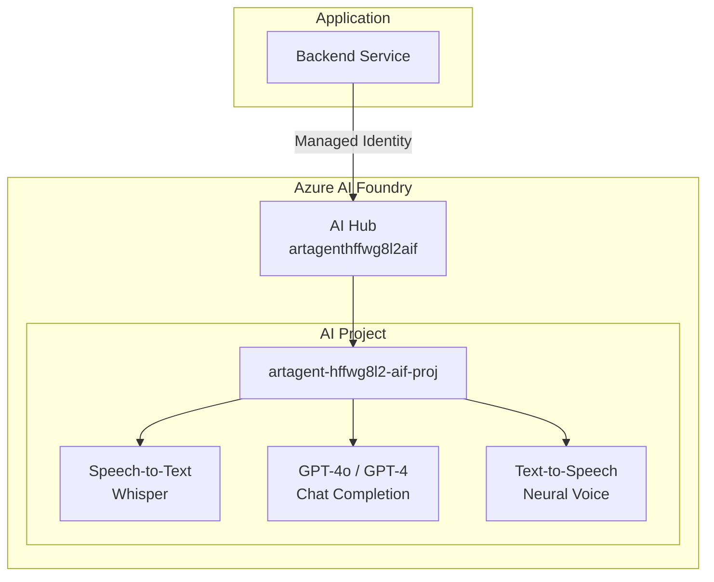

# Azure AI Services Integration

Detailed documentation for Azure AI Foundry integration in the Real-Time Audio Voice Agent.

## Overview

The voice agent uses Azure AI Foundry (formerly Azure OpenAI + Cognitive Services) for:
- **Speech-to-Text (STT)**: Converting spoken audio to text
- **Large Language Models (LLM)**: Generating conversational responses
- **Text-to-Speech (TTS)**: Converting text responses to natural speech

## Architecture



## Configuration

### Resource Details

| Property | Value |
|----------|-------|
| **AI Hub Name** | artagenthffwg8l2aif |
| **AI Project** | artagent-hffwg8l2-aif-proj |
| **Location** | eastus2 |
| **SKU** | S0 |
| **Kind** | AIServices |

### Endpoint

```
https://artagenthffwg8l2aif.cognitiveservices.azure.com/
```

---

## Speech-to-Text Integration

### Real-Time Transcription

```python
import azure.cognitiveservices.speech as speechsdk
from azure.identity import DefaultAzureCredential

# Setup with Managed Identity
credential = DefaultAzureCredential()
token = credential.get_token("https://cognitiveservices.azure.com/.default")

speech_config = speechsdk.SpeechConfig(
    auth_token=token.token,
    region="eastus2"
)
speech_config.speech_recognition_language = "en-US"

# Create recognizer for audio stream
audio_config = speechsdk.audio.AudioConfig(stream=audio_stream)
recognizer = speechsdk.SpeechRecognizer(
    speech_config=speech_config,
    audio_config=audio_config
)

# Handle continuous recognition
def handle_recognized(evt):
    if evt.result.reason == speechsdk.ResultReason.RecognizedSpeech:
        transcript = evt.result.text
        # Process transcript...

recognizer.recognized.connect(handle_recognized)
recognizer.start_continuous_recognition()
```

### STT Configuration Options

| Setting | Value | Description |
|---------|-------|-------------|
| Language | en-US | Primary recognition language |
| Profanity | Masked | Filter profanity in output |
| Punctuation | Auto | Automatic punctuation |
| Diarization | Off | Speaker identification |

---

## LLM Integration

### Chat Completion

```python
from azure.ai.inference import ChatCompletionsClient
from azure.ai.inference.models import SystemMessage, UserMessage
from azure.identity import DefaultAzureCredential

credential = DefaultAzureCredential()
client = ChatCompletionsClient(
    endpoint="https://artagenthffwg8l2aif.cognitiveservices.azure.com/",
    credential=credential
)

# System prompt for voice agent
SYSTEM_PROMPT = """You are a helpful voice assistant. Keep responses concise 
and conversational, suitable for spoken dialogue. Avoid long lists or 
complex formatting that doesn't translate well to speech."""

async def generate_response(user_message: str, conversation_history: list):
    messages = [
        SystemMessage(content=SYSTEM_PROMPT),
        *conversation_history,
        UserMessage(content=user_message)
    ]
    
    response = await client.complete(
        messages=messages,
        model="gpt-4o",
        temperature=0.7,
        max_tokens=150,  # Keep responses short for voice
    )
    
    return response.choices[0].message.content
```

### Model Configuration

| Model | Use Case | Max Tokens | Temperature |
|-------|----------|------------|-------------|
| gpt-4o | General conversation | 150 | 0.7 |
| gpt-4o-mini | Quick responses | 100 | 0.5 |

### Prompt Engineering for Voice

```python
# Voice-optimized system prompts
VOICE_AGENT_PROMPTS = {
    "default": """You are a voice assistant. Guidelines:
    - Keep responses under 50 words when possible
    - Use conversational, natural language
    - Avoid bullet points and numbered lists
    - Don't use markdown or special formatting
    - Ask clarifying questions if needed""",
    
    "customer_service": """You are a customer service voice agent. Guidelines:
    - Be polite and empathetic
    - Confirm understanding before proceeding
    - Offer to transfer to human agent when appropriate
    - Keep responses brief but complete"""
}
```

---

## Text-to-Speech Integration

### Neural Voice Synthesis

```python
import azure.cognitiveservices.speech as speechsdk

speech_config = speechsdk.SpeechConfig(
    auth_token=token.token,
    region="eastus2"
)

# Configure neural voice
speech_config.speech_synthesis_voice_name = "en-US-JennyNeural"

synthesizer = speechsdk.SpeechSynthesizer(
    speech_config=speech_config,
    audio_config=None  # Return audio data instead of playing
)

async def synthesize_speech(text: str) -> bytes:
    result = synthesizer.speak_text_async(text).get()
    
    if result.reason == speechsdk.ResultReason.SynthesizingAudioCompleted:
        return result.audio_data
    else:
        raise Exception(f"TTS failed: {result.reason}")
```

### Available Voices

| Voice | Language | Style | Use Case |
|-------|----------|-------|----------|
| en-US-JennyNeural | English (US) | Friendly | General |
| en-US-GuyNeural | English (US) | Professional | Business |
| en-US-AriaNeural | English (US) | Expressive | Customer service |
| en-GB-SoniaNeural | English (UK) | Warm | UK audience |

### SSML for Advanced Control

```python
ssml = """
<speak version="1.0" xmlns="http://www.w3.org/2001/10/synthesis" xml:lang="en-US">
    <voice name="en-US-JennyNeural">
        <prosody rate="medium" pitch="default">
            Hello! How can I help you today?
        </prosody>
        <break time="500ms"/>
        <prosody rate="slow" pitch="low">
            Please take your time.
        </prosody>
    </voice>
</speak>
"""
```

---

## Error Handling

### Retry Strategy

```python
from tenacity import retry, stop_after_attempt, wait_exponential
from azure.core.exceptions import ServiceResponseError, HttpResponseError

@retry(
    stop=stop_after_attempt(3),
    wait=wait_exponential(multiplier=1, min=2, max=10),
    retry=lambda e: isinstance(e, (ServiceResponseError, HttpResponseError))
)
async def call_ai_service(func, *args, **kwargs):
    return await func(*args, **kwargs)
```

### Error Types

| Error | Cause | Action |
|-------|-------|--------|
| 429 Too Many Requests | Rate limit | Retry with backoff |
| 401 Unauthorized | Token expired | Refresh token |
| 503 Service Unavailable | Service down | Retry, then failover |
| 400 Bad Request | Invalid input | Log and return error |

---

## Performance Optimization

### Latency Reduction

1. **Connection Pooling**: Reuse HTTP connections
2. **Regional Deployment**: Deploy close to AI region (eastus2)
3. **Streaming**: Use streaming APIs for real-time response
4. **Caching**: Cache common responses

### Streaming Responses

```python
# Stream LLM response for lower latency
async def stream_response(user_message: str):
    stream = await client.complete(
        messages=[UserMessage(content=user_message)],
        model="gpt-4o",
        stream=True
    )
    
    full_response = ""
    async for chunk in stream:
        if chunk.choices[0].delta.content:
            content = chunk.choices[0].delta.content
            full_response += content
            yield content  # Start TTS immediately
```

---

## Monitoring

### Key Metrics

| Metric | Target | Alert Threshold |
|--------|--------|-----------------|
| STT Latency (p95) | <500ms | >1000ms |
| LLM Latency (p95) | <2000ms | >5000ms |
| TTS Latency (p95) | <1000ms | >2000ms |
| Error Rate | <1% | >5% |

### Application Insights Queries

```kusto
// AI Service latency
dependencies
| where name contains "cognitiveservices"
| where timestamp > ago(1h)
| summarize 
    avg_duration = avg(duration),
    p95_duration = percentile(duration, 95),
    p99_duration = percentile(duration, 99)
    by bin(timestamp, 5m), target

// AI Service errors
dependencies
| where name contains "cognitiveservices"
| where success == false
| where timestamp > ago(24h)
| summarize count() by resultCode, target
```
