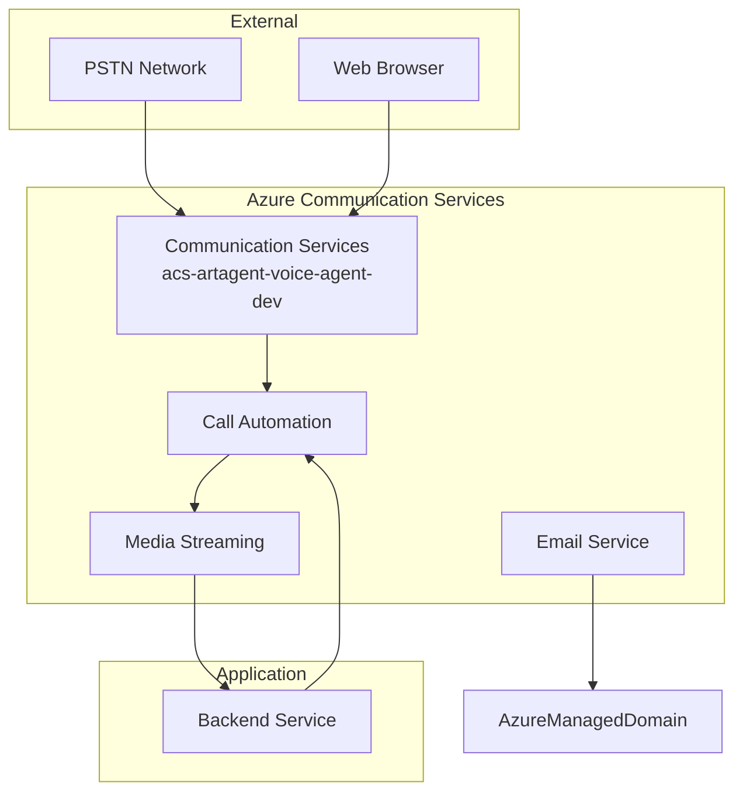
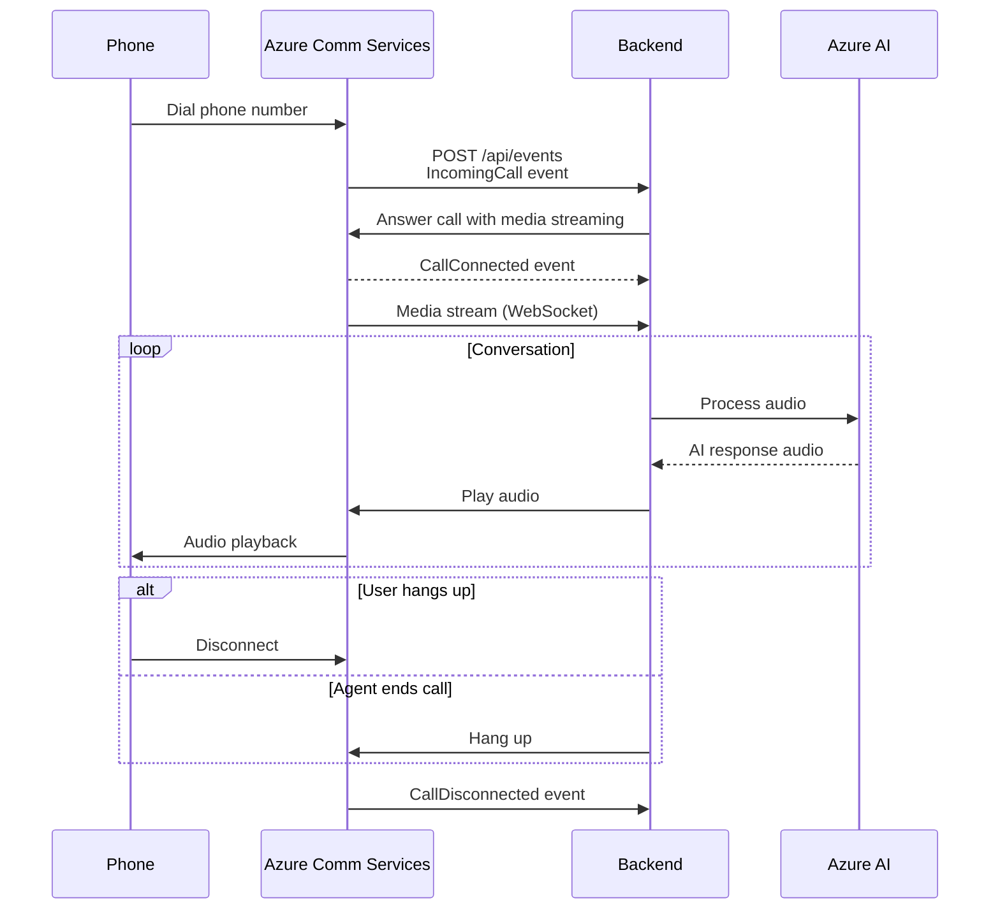

# Azure Communication Services Integration

Detailed documentation for Azure Communication Services (ACS) integration in the Real-Time Audio Voice Agent.

## Overview

Azure Communication Services provides:
- **Voice Calling**: PSTN and VoIP calling capabilities
- **Call Automation**: Programmatic call control and media handling
- **Audio Streaming**: Real-time audio access for AI processing
- **Email**: Transactional email sending

## Architecture



## Configuration

### Resource Details

| Property | Value |
|----------|-------|
| **Resource Name** | acs-artagent-voice-agent-dev-hffwg8l2 |
| **Location** | global |
| **Email Service** | email-artagent-voice-agent-dev-hffwg8l2 |
| **Email Domain** | AzureManagedDomain |

### Endpoint

```
https://acs-artagent-voice-agent-dev-hffwg8l2.communication.azure.com
```

---

## Call Automation Integration

### Handling Incoming Calls

```python
from azure.communication.callautomation import (
    CallAutomationClient,
    CallInvite,
    MediaStreamingOptions,
    MediaStreamingTransport,
    MediaStreamingContent,
    MediaStreamingAudioChannel
)
from azure.identity import DefaultAzureCredential

credential = DefaultAzureCredential()
client = CallAutomationClient(
    endpoint="https://acs-artagent-voice-agent-dev-hffwg8l2.communication.azure.com",
    credential=credential
)

# Webhook handler for incoming calls
async def handle_incoming_call(event: dict):
    incoming_call_context = event["incomingCallContext"]
    callback_url = "https://artagent-backend-hffwg8l2.eastus2.azurecontainerapps.io/api/callbacks"
    
    # Answer with media streaming enabled
    media_streaming = MediaStreamingOptions(
        transport_url="wss://artagent-backend-hffwg8l2.eastus2.azurecontainerapps.io/ws/media",
        transport_type=MediaStreamingTransport.WEBSOCKET,
        content_type=MediaStreamingContent.AUDIO,
        audio_channel_type=MediaStreamingAudioChannel.MIXED,
        start_media_streaming=True
    )
    
    answer_result = client.answer_call(
        incoming_call_context=incoming_call_context,
        callback_url=callback_url,
        media_streaming=media_streaming
    )
    
    return answer_result.call_connection_id
```

### Call Flow



---

## Media Streaming

### WebSocket Media Handler

```python
import asyncio
import websockets
import json

class MediaStreamHandler:
    def __init__(self, ai_processor):
        self.ai_processor = ai_processor
        self.audio_buffer = bytearray()
    
    async def handle_media_stream(self, websocket):
        """Handle incoming media stream from ACS"""
        async for message in websocket:
            data = json.loads(message)
            
            if data["kind"] == "AudioData":
                # Audio data is base64 encoded PCM
                audio_chunk = base64.b64decode(data["audioData"]["data"])
                self.audio_buffer.extend(audio_chunk)
                
                # Process when buffer is large enough
                if len(self.audio_buffer) >= 3200:  # 100ms of audio at 16kHz
                    response_audio = await self.ai_processor.process(
                        bytes(self.audio_buffer)
                    )
                    self.audio_buffer.clear()
                    
                    if response_audio:
                        await self.send_audio(websocket, response_audio)
            
            elif data["kind"] == "AudioMetadata":
                # Handle audio format information
                self.sample_rate = data["audioMetadata"]["sampleRate"]
                self.channels = data["audioMetadata"]["channels"]
    
    async def send_audio(self, websocket, audio_data: bytes):
        """Send audio back to the call"""
        message = {
            "kind": "AudioData",
            "audioData": {
                "data": base64.b64encode(audio_data).decode(),
                "timestamp": datetime.utcnow().isoformat(),
                "participantRawId": "backend-ai",
                "silent": False
            }
        }
        await websocket.send(json.dumps(message))
```

### Audio Format

| Property | Value |
|----------|-------|
| Encoding | PCM (Linear16) |
| Sample Rate | 16000 Hz |
| Bit Depth | 16-bit |
| Channels | Mono |
| Chunk Size | 20ms (640 bytes) |

---

## Call Control Actions

### Play Audio

```python
async def play_audio(call_connection_id: str, audio_url: str):
    """Play audio file to caller"""
    call_connection = client.get_call_connection(call_connection_id)
    
    play_source = FileSource(url=audio_url)
    
    await call_connection.play_media(
        play_source=play_source,
        play_to=[target_participant]
    )
```

### Play Text (TTS)

```python
async def play_text(call_connection_id: str, text: str):
    """Play text-to-speech to caller"""
    call_connection = client.get_call_connection(call_connection_id)
    
    play_source = TextSource(
        text=text,
        voice_name="en-US-JennyNeural"
    )
    
    await call_connection.play_media(
        play_source=play_source,
        play_to=[target_participant]
    )
```

### Transfer Call

```python
async def transfer_to_agent(call_connection_id: str, agent_number: str):
    """Transfer call to human agent"""
    call_connection = client.get_call_connection(call_connection_id)
    
    transfer_destination = PhoneNumberIdentifier(agent_number)
    
    await call_connection.transfer_call_to_participant(
        target_participant=transfer_destination
    )
```

---

## Event Handling

### Webhook Events

| Event | Description | Action |
|-------|-------------|--------|
| IncomingCall | New call received | Answer/Reject |
| CallConnected | Call answered | Start media streaming |
| CallDisconnected | Call ended | Cleanup resources |
| PlayCompleted | Audio playback finished | Continue conversation |
| PlayFailed | Playback error | Handle error |
| RecognizeCompleted | DTMF/Speech recognized | Process input |

### Event Handler

```python
from fastapi import FastAPI, Request

app = FastAPI()

@app.post("/api/callbacks")
async def handle_callback(request: Request):
    events = await request.json()
    
    for event in events:
        event_type = event["type"]
        
        if event_type == "Microsoft.Communication.CallConnected":
            await handle_call_connected(event)
        elif event_type == "Microsoft.Communication.CallDisconnected":
            await handle_call_disconnected(event)
        elif event_type == "Microsoft.Communication.PlayCompleted":
            await handle_play_completed(event)
        elif event_type == "Microsoft.Communication.PlayFailed":
            await handle_play_failed(event)
    
    return {"status": "ok"}
```

---

## Email Integration

### Sending Email

```python
from azure.communication.email import EmailClient
from azure.identity import DefaultAzureCredential

credential = DefaultAzureCredential()
email_client = EmailClient(
    endpoint="https://acs-artagent-voice-agent-dev-hffwg8l2.communication.azure.com",
    credential=credential
)

async def send_call_summary(to_email: str, call_summary: dict):
    """Send call summary email after conversation"""
    message = {
        "senderAddress": "DoNotReply@<AzureManagedDomain>",
        "recipients": {
            "to": [{"address": to_email}]
        },
        "content": {
            "subject": f"Call Summary - {call_summary['call_id']}",
            "plainText": f"""
Call Summary
============
Duration: {call_summary['duration']}
Topics Discussed: {', '.join(call_summary['topics'])}

Transcript:
{call_summary['transcript']}
            """,
            "html": f"""
<h1>Call Summary</h1>
<p><strong>Duration:</strong> {call_summary['duration']}</p>
<p><strong>Topics:</strong> {', '.join(call_summary['topics'])}</p>
<h2>Transcript</h2>
<pre>{call_summary['transcript']}</pre>
            """
        }
    }
    
    poller = email_client.begin_send(message)
    result = poller.result()
    return result.message_id
```

---

## Error Handling

### Common Errors

| Error Code | Description | Resolution |
|------------|-------------|------------|
| 400 | Invalid request | Check request format |
| 401 | Unauthorized | Verify credentials |
| 403 | Forbidden | Check RBAC permissions |
| 404 | Call not found | Call may have ended |
| 429 | Rate limited | Implement backoff |
| 500 | Server error | Retry with backoff |

### Retry Strategy

```python
from tenacity import retry, stop_after_attempt, wait_exponential

@retry(
    stop=stop_after_attempt(3),
    wait=wait_exponential(multiplier=1, min=2, max=10)
)
async def reliable_play_audio(call_connection_id: str, audio_url: str):
    await play_audio(call_connection_id, audio_url)
```

---

## Monitoring

### Key Metrics

| Metric | Target | Alert |
|--------|--------|-------|
| Call Answer Rate | >95% | <90% |
| Call Drop Rate | <2% | >5% |
| Media Stream Latency | <200ms | >500ms |
| Email Delivery Rate | >99% | <95% |

### Telemetry

```python
from opentelemetry import trace

tracer = trace.get_tracer(__name__)

async def handle_call_with_tracing(event: dict):
    with tracer.start_as_current_span("handle_incoming_call") as span:
        span.set_attribute("call.id", event["callConnectionId"])
        span.set_attribute("call.from", event["from"]["phoneNumber"]["value"])
        
        result = await handle_incoming_call(event)
        
        span.set_attribute("call.result", "answered")
        return result
```
