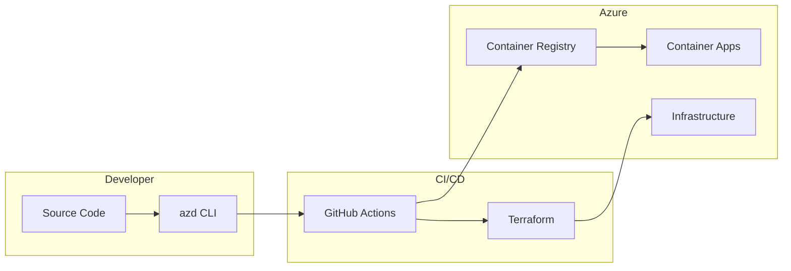

# Deployment Guide

This runbook covers deployment procedures for the Real-Time Audio Voice Agent infrastructure.

## Prerequisites

### Required Tools

```bash
# Azure CLI
az --version  # >= 2.55.0

# Azure Developer CLI
azd version  # >= 1.5.0

# Terraform
terraform --version  # >= 1.5.0

# Docker (for local development)
docker --version
```

### Azure Access

- Access to subscription `AI_Foundry` (`094336d1-8e03-42a4-95dc-1085ed02d8d5`)
- Role: `Contributor` on resource group `rg-artagent-voice-agent-dev`
- Role: `Key Vault Secrets User` for secret access

---

## Deployment Architecture



---

## Infrastructure Deployment

### Using Azure Developer CLI (azd)

```bash
# Login to Azure
azd auth login

# Initialize environment (first time)
azd init

# Set environment
azd env select voice-agent-dev

# Deploy infrastructure and application
azd up
```

### Using Terraform Directly

```bash
# Navigate to infrastructure directory
cd infra/terraform

# Initialize Terraform
terraform init

# Plan changes
terraform plan -var-file="environments/dev.tfvars"

# Apply changes
terraform apply -var-file="environments/dev.tfvars"
```

---

## Application Deployment

### Container Image Build & Push

```bash
# Login to Azure Container Registry
az acr login --name crartagenthffwg8l2

# Build and push backend
docker build -t crartagenthffwg8l2.azurecr.io/rtaudio-server:latest ./backend
docker push crartagenthffwg8l2.azurecr.io/rtaudio-server:latest

# Build and push frontend
docker build -t crartagenthffwg8l2.azurecr.io/rtaudio-client:latest ./frontend
docker push crartagenthffwg8l2.azurecr.io/rtaudio-client:latest
```

### Container App Update

```bash
# Update backend container app
az containerapp update \
  --name artagent-backend-hffwg8l2 \
  --resource-group rg-artagent-voice-agent-dev \
  --image crartagenthffwg8l2.azurecr.io/rtaudio-server:latest

# Update frontend container app
az containerapp update \
  --name artagent-frontend-hffwg8l2 \
  --resource-group rg-artagent-voice-agent-dev \
  --image crartagenthffwg8l2.azurecr.io/rtaudio-client:latest
```

---

## Environment Configuration

### App Configuration Settings

```bash
# Set configuration value
az appconfig kv set \
  --name appconfig-voice-agent-dev-hffwg8l2 \
  --key "Backend:MaxConcurrentCalls" \
  --value "10"

# Set feature flag
az appconfig feature set \
  --name appconfig-voice-agent-dev-hffwg8l2 \
  --feature "EnableEmailNotifications" \
  --yes
```

### Key Vault Secrets

```bash
# Set a secret
az keyvault secret set \
  --vault-name kv-hffwg8l2 \
  --name "ExternalApiKey" \
  --value "your-secret-value"
```

---

## Deployment Checklist

### Pre-Deployment

- [ ] Verify Azure CLI authentication
- [ ] Check resource group permissions
- [ ] Review Terraform plan output
- [ ] Verify container images build successfully
- [ ] Check Application Insights for existing issues

### Deployment

- [ ] Deploy infrastructure changes (if any)
- [ ] Push new container images
- [ ] Update Container Apps with new images
- [ ] Verify health endpoints respond correctly

### Post-Deployment

- [ ] Monitor Application Insights for errors
- [ ] Verify all Container App replicas are healthy
- [ ] Test voice agent functionality
- [ ] Check Log Analytics for any warnings

---

## Rollback Procedures

### Container App Rollback

```bash
# List revisions
az containerapp revision list \
  --name artagent-backend-hffwg8l2 \
  --resource-group rg-artagent-voice-agent-dev \
  --output table

# Activate previous revision
az containerapp revision activate \
  --name artagent-backend-hffwg8l2 \
  --resource-group rg-artagent-voice-agent-dev \
  --revision <previous-revision-name>

# Deactivate current revision
az containerapp revision deactivate \
  --name artagent-backend-hffwg8l2 \
  --resource-group rg-artagent-voice-agent-dev \
  --revision <current-revision-name>
```

### Infrastructure Rollback

```bash
# View Terraform state history (if using remote state)
terraform state list

# Rollback to previous Terraform state
# Option 1: Revert code and re-apply
git checkout HEAD~1 -- infra/
terraform apply

# Option 2: Use Terraform import for specific resources
```

---

## Monitoring Deployment

### Check Container App Status

```bash
# View container app details
az containerapp show \
  --name artagent-backend-hffwg8l2 \
  --resource-group rg-artagent-voice-agent-dev \
  --query "{name:name, state:properties.runningStatus, replicas:properties.template.scale}"

# View logs
az containerapp logs show \
  --name artagent-backend-hffwg8l2 \
  --resource-group rg-artagent-voice-agent-dev \
  --follow
```

### Application Insights Queries

```kusto
// Recent exceptions
exceptions
| where timestamp > ago(1h)
| order by timestamp desc
| take 50

// Request failures
requests
| where timestamp > ago(1h)
| where success == false
| summarize count() by name, resultCode
```

---

## Troubleshooting

### Common Issues

| Issue | Cause | Resolution |
|-------|-------|------------|
| Container fails to start | Missing secrets | Check Key Vault access |
| AI calls failing | Invalid endpoint | Verify AI Foundry configuration |
| No telemetry | Wrong connection string | Check App Insights config |
| Voice calls failing | ACS misconfigured | Verify ACS endpoint and credentials |

### Useful Commands

```bash
# Check container app environment status
az containerapp env show \
  --name cae-artagent-voice-agent-dev-hffwg8l2 \
  --resource-group rg-artagent-voice-agent-dev

# Test Key Vault access
az keyvault secret list --vault-name kv-hffwg8l2

# Check AI service status
az cognitiveservices account show \
  --name artagenthffwg8l2aif \
  --resource-group rg-artagent-voice-agent-dev
```
